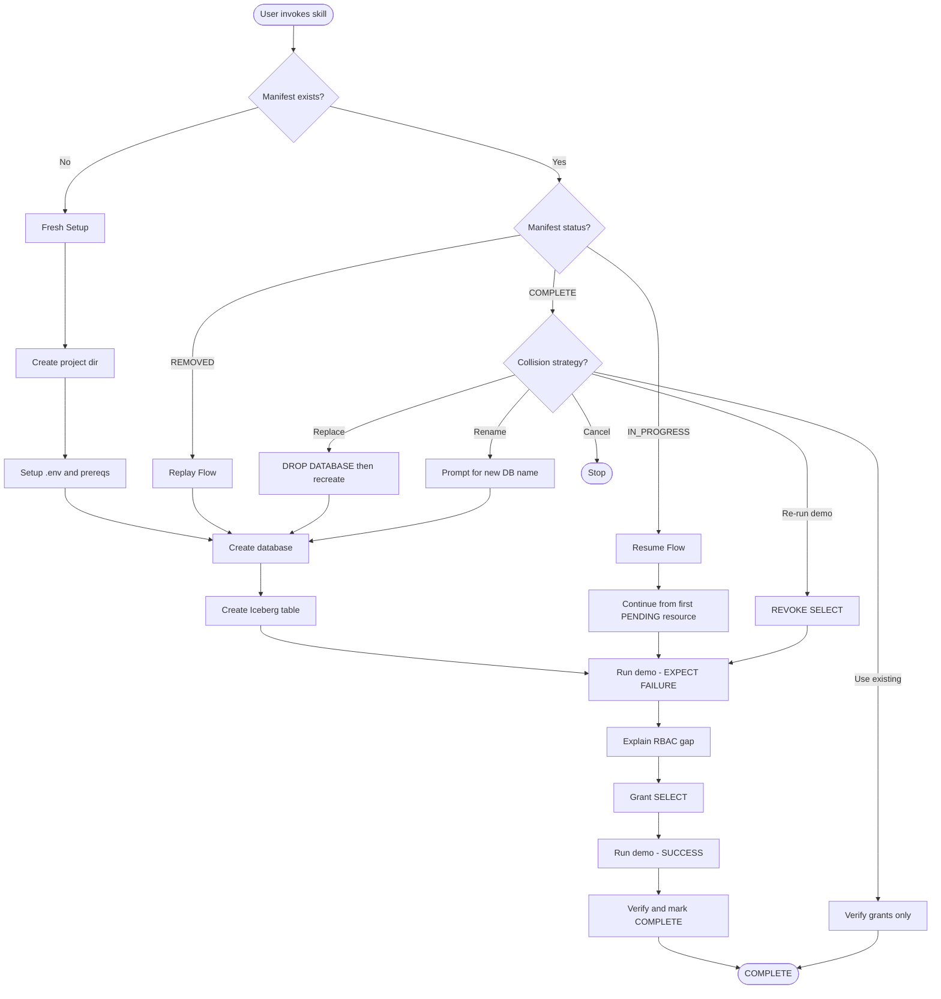

# HIRC DuckDB Demo

A Cortex Code skill for querying Snowflake-managed Iceberg tables with DuckDB through the Horizon Iceberg REST Catalog (HIRC) API.

## What It Does

This skill demonstrates:

- Connecting DuckDB to Snowflake's HIRC
- OAuth2 authentication using Programmatic Access Tokens (PAT)
- Snowflake RBAC (Role-Based Access Control) for external engine access
- Deliberate failure pedagogy: demo fails → explains RBAC → grants access → demo succeeds

## Prerequisites

### Accounts Required

- **Snowflake Account** - With a role that can create databases and grant privileges
- **AWS Account** - With permissions to create S3 buckets, IAM roles, and IAM policies

### Tools (Skills will prompt if missing)

- [Cortex Code CLI](https://docs.snowflake.com/en/developer-guide/snowflake-cli/cortex-code-cli/overview)
- [uv](https://astral.sh/uv) - Python package manager
- [Snow CLI](https://docs.snowflake.com/en/developer-guide/snowflake-cli/overview)
- [AWS CLI](https://aws.amazon.com/cli/) - For external volume creation

### Dependent Skills

```bash
cortex skill add https://github.com/kameshsampath/snow-utils-skills/snow-utils-pat
cortex skill add https://github.com/kameshsampath/snow-utils-skills/snow-utils-volumes
```

> [!TIP]
> You don't need to install dependent skills manually. The skill will detect missing dependencies and prompt you to install them during setup.

## Installation

```bash
cortex skill add https://github.com/kameshsampath/kamesh-demo-skills/hirc-duckdb-demo
```

## Usage

### Option 1: Invoke the Skill (Recommended)

Say any of these in Cortex Code:

```
Set up HIRC DuckDB demo
```

```
Run hirc duckdb demo
```

```
Horizon catalog demo
```

To re-experience the RBAC fail-then-fix lesson after completing the demo:

```
Re-run hirc demo
```

```
Show RBAC failure again
```

The skill guides you through:

1. Creating project directory
2. Checking/installing prerequisite skills
3. Setting up .env
4. Creating demo database
5. Creating Iceberg table and loading sample data
6. Running demo (expect failure - no SELECT grant yet)
7. Explaining why it failed (RBAC lesson)
8. Granting SELECT permission
9. Running demo again (success!)

### Option 2: Manual Commands

If you prefer step-by-step control:

| Step | Command |
|------|---------|
| Create project | `Create project directory for HIRC demo` |
| Check prereqs | `Check if snow-utils-pat has been run` |
| Create database | `Create demo database for HIRC demo` |
| Create table | `Create sample FRUITS Iceberg table` |
| Run demo | `Run the DuckDB demo against HIRC` |
| Grant RBAC | `Grant SELECT on FRUITS table to SA_ROLE` |
| Cleanup | `Cleanup hirc demo resources` |
| Replay | `Replay hirc demo from manifest` |
| Re-run demo | `Re-run hirc demo` |

## Manifest and Replay

The skill creates a **manifest file** (`.snow-utils/snow-utils-manifest.md`) that tracks all created resources. This manifest serves multiple purposes:

### Export Manifest for Sharing

After completing the demo, you can export your manifest so another user can replay the entire setup on their account:

```
Export manifest for sharing
```

Cortex Code will:
1. Verify all skill sections are `COMPLETE`
2. Create `hirc-duckdb-demo-manifest.md` in the project root
3. Set all statuses to `REMOVED` (so the receiver replays from scratch)
4. Add `# ADAPT:` markers on user-prefixed values (so the receiver can adapt names)
5. Inject `CORTEX_CODE_INSTRUCTION`, `shared_info`, and `required_skills` sections

Share the exported file via email, Slack, or push it to a GitHub repo. The receiver opens it in Cortex Code and says "setup from shared manifest".

> [!NOTE]
> The exported manifest contains resource names and configuration, not credentials. Each user needs their own Snowflake connection and AWS credentials.

### Replay from Shared Manifest

Another user can replay from a local manifest file or a remote URL:

```
Setup from shared manifest
```

```
Setup from https://github.com/kameshsampath/kamesh-demo-skills/blob/main/example-manifests/hirc-duckdb-demo-manifest.md
```

Cortex Code will translate the GitHub URL to a raw download URL, confirm the download, save the manifest to the current directory, and proceed with name adaptation and replay.

> [!NOTE]
> The manifest contains resource names and configuration, not credentials. Each user needs their own Snowflake connection and AWS credentials.

### Resume Interrupted Setup

If setup is interrupted, the manifest tracks progress:

```
Resume hirc demo setup
```

The skill reads DONE/PENDING status for each resource and continues from where it left off.

### Cleanup Tracking

The manifest includes cleanup instructions for each resource:

```
Cleanup hirc demo resources
```

> [!WARNING]
> Cleanup only removes Snowflake resources (demo database). The manifest file is preserved with status `REMOVED` to enable future replays. Infrastructure created by `snow-utils-pat` and `snow-utils-volumes` is also preserved.

### Re-run Demo (Pedagogical Loop)

After the demo is complete, you can re-experience the fail-then-fix RBAC lesson without destroying any infrastructure:

```
Re-run hirc demo
```

This lightweight flow:

1. Revokes SELECT on the FRUITS table from SA_ROLE
2. Runs DuckDB demo (fails - no SELECT)
3. Explains why it failed (RBAC lesson)
4. Grants SELECT back
5. Runs DuckDB demo again (succeeds)

> [!TIP]
> This is ideal for live demos, workshops, or when you want to walk someone through the RBAC concepts again.

## Lifecycle Flowchart



## Project Structure

After setup, your project directory contains:

```
${PROJECT_DIR}/
├── .env                         # Environment variables
├── .snow-utils/
│   └── snow-utils-manifest.md   # Resource tracking (shareable)
├── sql/
│   ├── demo.sql                 # DuckDB query script
│   ├── demo_setup.sql           # Database creation
│   ├── sample_data.sql          # Iceberg table + sample data
│   ├── rbac.sql                 # Grant SELECT
│   ├── revoke_rbac.sql          # Revoke SELECT (re-run flow)
│   └── cleanup.sql              # Remove database
├── workbook.ipynb               # Jupyter notebook
└── pyproject.toml               # Python dependencies
```

## Environment Variables

| Variable | Description | Source |
|----------|-------------|--------|
| SNOWFLAKE_DEFAULT_CONNECTION_NAME | Snow CLI connection | snow-utils-pat |
| SNOWFLAKE_ACCOUNT | Account identifier | snow-utils-pat |
| SNOWFLAKE_USER | User name | snow-utils-pat |
| SNOWFLAKE_ACCOUNT_URL | Account URL (org-account format) | snow-utils-pat |
| SA_ROLE | Service account role | snow-utils-pat |
| SA_PAT | Programmatic Access Token | snow-utils-pat |
| SNOW_UTILS_DB | Utils database | snow-utils-pat |
| EXTERNAL_VOLUME_NAME | External volume for Iceberg | snow-utils-volumes |
| DEMO_DATABASE | Demo database name | This skill |

> [!NOTE]
> `ADMIN_ROLE` is stored in the manifest, not in `.env`.

## Direct Usage

After setup, run DuckDB directly:

```bash
cd ${PROJECT_DIR}

# Install dependencies (first time only)
uv sync

# Load environment and run demo
set -a && source .env && set +a && envsubst < sql/demo.sql | uv run duckdb -bail
```

Or use the Jupyter notebook:

```bash
uv run jupyter notebook workbook.ipynb
```

## Files

| File | Purpose |
|------|---------|
| `SKILL.md` | Cortex Code skill definition |
| `.env.example` | Environment template |
| `sql/demo.sql` | DuckDB query script |
| `sql/demo_setup.sql` | Create demo database |
| `sql/sample_data.sql` | Create Iceberg table with sample data |
| `sql/rbac.sql` | Grant SELECT access |
| `sql/revoke_rbac.sql` | Revoke SELECT (re-run flow) |
| `sql/cleanup.sql` | Teardown demo resources |

## License

Apache License 2.0 - See [LICENSE](../LICENSE) for details.
