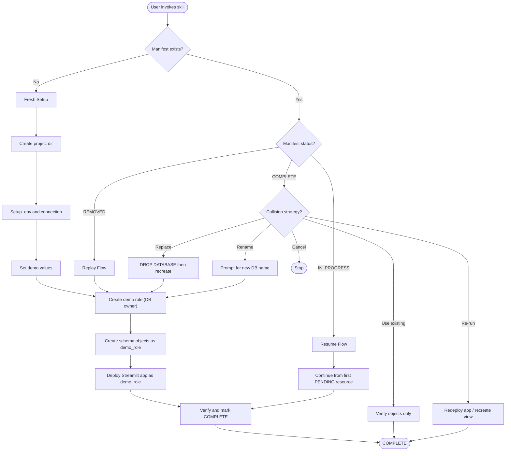

# Smart Crowd Counter

A Cortex Code skill for deploying a Streamlit-in-Snowflake app that uses Snowflake Cortex AISQL to analyze conference photos, count attendees, and detect raised hands for real-time insights.

## What It Does

This skill demonstrates:

- **Least-privilege role management** -- creates a dedicated demo role that owns the DB (no account-level privileges)
- Snowflake Cortex AISQL for image analysis
- Streamlit in Snowflake (SiS) for building interactive apps
- Stage-based image storage with directory tables
- AI-powered views that process images on query

## Prerequisites

### Accounts Required

- **Snowflake Account** - With Cortex AISQL enabled and an admin role (e.g., ACCOUNTADMIN) that can create roles and databases

### Tools (Skills will prompt if missing)

- [Cortex Code CLI](https://docs.snowflake.com/en/developer-guide/snowflake-cli/cortex-code-cli/overview)
- [uv](https://astral.sh/uv) - Python package manager
- [Snow CLI](https://docs.snowflake.com/en/developer-guide/snowflake-cli/overview) (v3.14.0+)

> [!NOTE]
> This skill is **standalone** -- it does not depend on snow-utils-pat or snow-utils-volumes. It only needs a Snowflake connection with sufficient privileges.

## Installation

```bash
cortex skill add https://github.com/kameshsampath/kamesh-demo-skills/smart-crowd-counter
```

## Usage

### Option 1: Invoke the Skill (Recommended)

Say any of these in Cortex Code to get started:

```
Set up smart crowd counter
```

```
Run crowd counter demo
```

```
Conference photo analysis demo
```

```
Cortex AISQL demo
```

```
Streamlit crowd counter
```

To replay from a shared manifest:

```
Setup from shared manifest
```

```
Replay crowd counter from manifest
```

To redeploy the app after editing:

```
Re-run crowd counter
```

```
Redeploy crowd counter app
```

The skill guides you through:

1. Creating project directory
2. Setting up .env with Snowflake connection
3. Configuring demo values (database, schema, stage, AI model)
4. Creating a least-privilege demo role (owns DB, USAGE on warehouse)
5. Creating Snowflake objects (schema, stage, AI view) as the demo role
6. Deploying the Streamlit app to Snowflake as the demo role
7. Verifying setup and showing usage instructions

### Option 2: Manual Commands

If you prefer step-by-step control:

| Step | Command |
|------|---------|
| Create project | `Create project directory for crowd counter demo` |
| Check connection | `Check Snowflake connection for crowd counter` |
| Create objects | `Create demo database for crowd counter` |
| Deploy app | `Deploy crowd counter Streamlit app` |
| Cleanup | `Cleanup crowd counter resources` |
| Replay | `Replay crowd counter from manifest` |
| Re-run | `Redeploy crowd counter app` |

## Using the App

Once deployed:

1. Open the Streamlit app in Snowsight (Projects > Streamlit > SMART_CROWD_COUNTER)
2. The app automatically connects to the demo database and schema
3. Upload conference photos (JPG, JPEG, PNG only)
4. Wait for the AI analysis to complete
5. Click on any row to see the image and detailed charts

**From command line:**

```bash
# Upload images
snow stage copy /path/to/photos/*.jpg @DEMO_DB.CONFERENCES.SNAPS/

# Refresh stage
snow sql -q "ALTER STAGE DEMO_DB.CONFERENCES.SNAPS REFRESH"

# Query results
snow sql -q "SELECT name, total_attendees, raised_hands, percentage_with_hands_up FROM DEMO_DB.CONFERENCES.SMART_CROWD_COUNTER"
```

## Manifest and Replay

The skill creates a **manifest file** (`.snow-utils/snow-utils-manifest.md`) that tracks all created resources.

### Export Manifest for Sharing

After completing the demo, export your manifest so another user can replay:

```
Export manifest for sharing
```

### Replay from Shared Manifest

Another user can replay from a local manifest file or a remote URL:

```
Setup from shared manifest
```

```
Setup from https://github.com/kameshsampath/kamesh-demo-skills/blob/main/example-manifests/smart-crowd-counter-manifest.md
```

### Resume Interrupted Setup

If setup is interrupted, the manifest tracks progress:

```
Resume crowd counter setup
```

### Cleanup

```
Cleanup crowd counter resources
```

> [!WARNING]
> Cleanup is **irreversible**. It drops the entire demo database (including all uploaded images and the Streamlit app) using the demo role, then revokes and drops the demo role using the admin role.

## Lifecycle Flowchart



## Project Structure

After setup, your project directory contains:

```
${PROJECT_DIR}/
├── .env                         # Environment variables (incl. DEMO_ROLE)
├── .snow-utils/
│   └── snow-utils-manifest.md   # Resource tracking (shareable)
├── sql/
│   ├── create_role.sql          # Create demo role, DB, grant ownership
│   ├── setup.sql                # Schema, stage, view creation (as demo_role)
│   ├── create_warehouse.sql     # Create warehouse + grant to demo_role
│   ├── cleanup.sql              # Drop database
│   └── cleanup_role.sql         # Revoke and drop demo role
├── app/
│   ├── streamlit_app.py         # Streamlit application
│   ├── environment.yml          # SiS conda dependencies
│   ├── snowflake.yml.template   # Deployment manifest template
│   └── snowflake.yml            # Generated deployment manifest
└── pyproject.toml               # Python dependencies
```

## Environment Variables

| Variable | Description | Source |
|----------|-------------|--------|
| SNOWFLAKE_DEFAULT_CONNECTION_NAME | Snow CLI connection | User |
| SNOWFLAKE_ACCOUNT | Account identifier | Connection |
| SNOWFLAKE_USER | User name | Connection |
| SNOWFLAKE_WAREHOUSE | Warehouse for queries | Connection |
| DEMO_DATABASE | Demo database name | This skill |
| DEMO_SCHEMA | Demo schema name | This skill |
| DEMO_STAGE | Image stage name | This skill |
| DEMO_ROLE | Demo role (DB owner, least privilege) | This skill |
| AI_MODEL | Cortex AI model | This skill |

> [!NOTE]
> `ADMIN_ROLE` is stored in the manifest, not in `.env`. `DEMO_ROLE` is stored in both `.env` and the manifest.

## Files

| File | Purpose |
|------|---------|
| `SKILL.md` | Cortex Code skill definition |
| `.env.example` | Environment template |
| `sql/create_role.sql` | Create demo role, DB, grant ownership + WH access |
| `sql/setup.sql` | Create schema, stage, AI view (as demo_role) |
| `sql/create_warehouse.sql` | Create warehouse + grant access to demo_role |
| `sql/cleanup.sql` | Drop demo database (as demo role, the DB owner) |
| `sql/cleanup_role.sql` | Revoke and drop demo role |
| `app/streamlit_app.py` | Streamlit application |
| `app/environment.yml` | SiS conda dependencies |
| `app/snowflake.yml.template` | Deployment manifest template |

## License

Apache License 2.0 - See [LICENSE](../LICENSE) for details.
